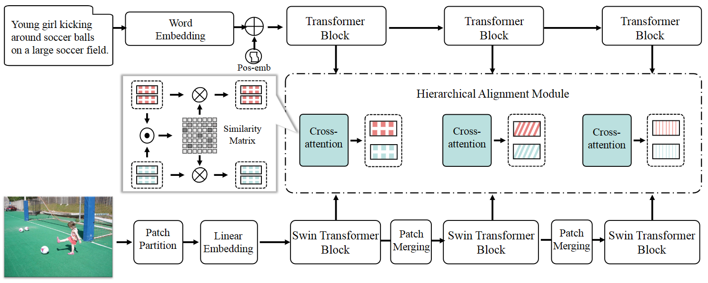

# HAT
Implementation of our paper, "[Unifying Two-Stream Encoders with Transformers for Cross-Modal Retrieval](https://arxiv.org/abs/2308.04343)". This repo is built on top of [METER](https://github.com/zdou0830/METER).

## Introduction
Cross-modal retrieval is an important and fundamental problem in the field of vision and language, aiming to perceive and understand the semantic correspondences between images and texts. Most existing methods employ two-stream encoders with different architectures for images and texts, e.g., CNN for images and RNN/Transformer for texts. Such discrepancy in architectures may induce different semantic distribution spaces and limit the interactions between images and texts, and further result in inferior alignment between images and texts. To fill this research gap, inspired by recent advances of Transformers in vision tasks, we propose to unify the encoder architectures with Transformers for both modalities. Specifically, we design a cross-modal retrieval framework purely based on two-stream Transformers, dubbed **Hierarchical Alignment Transformers (HAT)**, which consists of an image Transformer, a text Transformer, and a hierarchical alignment module. With such identical architectures, the encoders could produce representations with more similar characteristics for images and texts, and make the interactions and alignments between them much easier. Besides, to leverage the rich semantics, we devise a hierarchical alignment scheme to explore multi-level correspondences of different layers between images and texts. To evaluate the effectiveness of the proposed HAT, we conduct extensive experiments on two benchmark datasets, MSCOCO and Flickr30K. Experimental results demonstrate that HAT outperforms SOTA baselines by a large margin. Specifically, on two key tasks, *i.e.*, image-to-text and text-to-image retrieval, HAT achieves 7.6\% and 16.7\% relative score improvement of Recall@1 on MSCOCO, and 4.4\% and 11.6\% on Flickr30k respectively. 



## Requirements 
We recommended the following dependencies.

* Python 3.8 
* [PyTorch](http://pytorch.org/) (1.8.1)
* [NumPy](http://www.numpy.org/) (>=1.23.4)
* [transformers](https://huggingface.co/docs/transformers) (4.6.0)
* [timm](https://timm.fast.ai/) (0.4.12)
* [torchvision]()

For details, check the [requirements.txt](https://github.com/LuminosityX/HAT/blob/main/requirements.txt) file

## Download data and pretrained model

The raw images can be downloaded from their original sources [here](http://shannon.cs.illinois.edu/DenotationGraph/) and [here](http://mscoco.org/). We refer to the path of extracted files as `$DATA_PATH`.

If you don't want to train from scratch, you can download the pretrained checkpoints of HAT from GoogleDrive, [Flickr30K](https://drive.google.com/file/d/11Zax1FTNnq0rcer8PxZFlx1mf7d-S67n/view?usp=drive_link)  (for Flickr30K dataset) and [MSCOCO](https://drive.google.com/file/d/1lQDeGvipaREZcwd7-owfgPidft6f4lHo/view?usp=drive_link)  (for MSCOCO dataset).

## Training
Run `run.py`:

For HAT on Flickr30K:

```bash
python run.py with data_root=`$DATA_PATH`
```

For HAT on MSCOCO:

```bash
python run.py with coco_config data_root=`$DATA_PATH`
```


## Testing with checkpoints

Test on Flickr30K:

```bash
python run.py with data_root=`$DATA_PATH` test_only=True checkpoint=`$CHECKPOINT_PATH`
```

Test on MSCOCO:

```bash
python run.py with coco_config data_root=`$DATA_PATH` test_only=True checkpoint=`$CHECKPOINT_PATH`
```


## Reference

```
@inproceedings{bin2023unifying,
  title={Unifying Two-Stream Encoders with Transformers for Cross-Modal Retrieval},
  author={Bin, Yi and Li, Haoxuan and Xu, Yahui and Xu, Xing and Yang, Yang and Shen, Heng Tao},
  booktitle={Proceedings of the 31st ACM International Conference on Multimedia},
  pages={3041--3050},
  year={2023}
}
```
